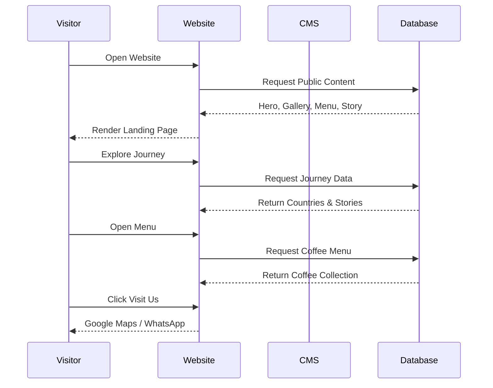
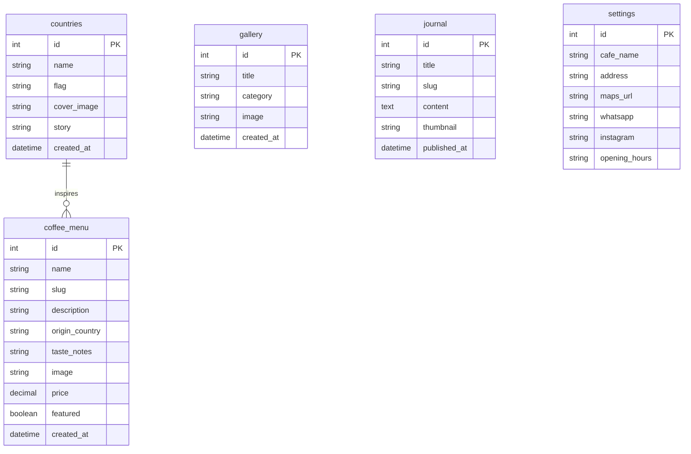

# PRD — Project Requirements Document

# Jelajah27 Coffee — Official Website & Digital Experience

**Version:** 1.0
**Status:** Ready for Development (MVP)
**Author:** Krisna Putra
**Project Type:** Public Marketing Website / Personal Branding / Coffee Shop Landing Experience

---

# 1. Overview

**Jelajah27 Coffee** merupakan website resmi sebuah coffee shop dengan konsep **Travel × Vintage × Storytelling**. Website ini bukan hanya sebagai media informasi, melainkan menjadi pengalaman digital pertama bagi calon pengunjung sebelum mereka datang ke café.

Nama **Jelajah27** memiliki filosofi bahwa sang owner telah menjelajahi **27 negara**, dan setiap perjalanan tersebut menjadi inspirasi bagi suasana café, menu, hingga cerita yang disampaikan kepada pelanggan.

Mayoritas pengunjung akan datang melalui Instagram, TikTok, Google Maps, atau hasil pencarian Google. Oleh karena itu website harus mampu memberikan kesan premium dalam beberapa detik pertama sehingga pengunjung merasa tertarik untuk datang langsung ke café.

Website mengedepankan visual sinematik, fotografi berkualitas tinggi, micro-animation, serta storytelling yang emosional untuk membangun identitas brand yang kuat.

---

# 2. Requirements

Berikut merupakan persyaratan utama pengembangan website.

* **Platform**

  * Website responsive.
  * Mobile First.
  * Desktop Friendly.
  * Progressive enhancement.

* **Target Pengunjung**

  * Calon pelanggan café.
  * Wisatawan.
  * Pecinta kopi.
  * Pengguna Instagram.
  * Pengguna Google Search.

* **Brand Experience**

  * Mengedepankan storytelling.
  * Visual premium.
  * Vintage aesthetic.
  * Travel inspired.
  * Tidak terasa seperti website coffee shop biasa.

* **Performance**

  * Loading cepat.
  * Optimized Image.
  * SEO Friendly.
  * Accessibility (WCAG).

* **Content Management**

  * Konten dapat diperbarui tanpa mengubah source code (opsional melalui CMS/Admin Panel pada fase berikutnya).

---

# 3. Core Features

## 1. Landing Hero Experience

Halaman pertama harus memberikan pengalaman visual yang kuat.

Fitur:

* Fullscreen Hero
* Background Video / Cinematic Image
* Animated Typography
* CTA Button
* Smooth Scroll

Contoh CTA

* Explore Our Journey
* Visit Our Café

---

## 2. Our Story

Menjelaskan filosofi Jelajah27 Coffee.

Berisi:

* Cerita Owner
* Filosofi Nama
* Perjalanan 27 Negara
* Mengapa Membuka Coffee Shop

---

## 3. Signature Coffee Collection

Menampilkan menu unggulan.

Setiap menu memiliki:

* Foto
* Nama
* Deskripsi
* Inspirasi Negara
* Taste Notes
* Harga

Contoh:

* Kyoto Morning
* Istanbul Blend
* Paris Roast
* Alpine Espresso
* Bali Sunrise

---

## 4. Journey Collection

Section paling ikonik.

Menampilkan daftar negara yang telah dikunjungi owner.

Setiap negara memiliki:

* Cover Image
* Cerita Singkat
* Coffee Experience
* Rekomendasi Menu
* Gallery

---

## 5. Gallery Experience

Gallery bukan sekadar foto.

Kategori:

* Interior
* Coffee
* Travel
* Behind The Scene
* Community
* Vintage Collection

Layout menggunakan Masonry Grid.

---

## 6. Visit Us

Informasi café.

Berisi:

* Alamat
* Jam Operasional
* Google Maps
* WhatsApp
* Instagram
* Reservasi (opsional)

---

## 7. Coffee Journal

Blog sederhana.

Kategori:

* Coffee Story
* Travel Story
* Brewing
* Event
* Lifestyle

SEO menjadi prioritas utama pada fitur ini.

---

## 8. Footer Experience

Footer dibuat sebagai closing storytelling.

Contoh quote:

> "Not every journey is measured in miles.
> Some are measured in cups of coffee."

---

# 4. User Flow

## Visitor Journey

1.

Pengunjung melihat Instagram Jelajah27 Coffee.

↓

2.

Klik Link Website.

↓

3.

Masuk ke Hero Landing.

↓

4.

Melihat Story & Filosofi.

↓

5.

Scroll melihat:

* Menu
* Gallery
* Journey
* Interior Café

↓

6.

Melihat lokasi café.

↓

7.

Klik Google Maps / WhatsApp.

↓

8.

Datang ke Café.

---

# 5. Architecture



---

# 6. Database Schema



| Tabel           | Deskripsi                                                                      |
| --------------- | ------------------------------------------------------------------------------ |
| **coffee_menu** | Menyimpan seluruh menu kopi beserta inspirasi negara asal cerita.              |
| **countries**   | Menyimpan daftar 27 negara yang menjadi inspirasi perjalanan owner.            |
| **gallery**     | Menyimpan seluruh foto interior, kopi, event, dan perjalanan.                  |
| **journal**     | Artikel blog untuk SEO dan storytelling.                                       |
| **settings**    | Informasi utama café seperti alamat, WhatsApp, Instagram, dan jam operasional. |

---

# 7. Website Structure

```
Home

├── Hero

├── About Jelajah27

├── Signature Coffee

├── 27 Countries Journey

├── Gallery

├── Coffee Journal

├── Visit Us

└── Footer
```

---

# 8. UI / UX Guidelines

## Design Style

Website harus memiliki identitas visual:

* Vintage Coffee House
* Traveler Journal
* Editorial Magazine
* Minimal Luxury
* Warm & Cozy
* Storytelling Experience

---

## Color Palette

Primary

```
Espresso Brown
#3A2618
```

Secondary

```
Vintage Cream
#F5EFE6
```

Accent

```
Antique Gold
#B08D57
```

Dark

```
#1E1E1E
```

Success

```
Forest Green
#4D5B45
```

---

## Typography

Heading

* Cormorant Garamond

Body

* Inter

Accent

* Special Elite *(opsional untuk sentuhan vintage pada quote atau jurnal perjalanan)*

---

## Motion

Animasi harus halus dan tidak berlebihan.

Contoh:

* Fade In
* Parallax Image
* Smooth Scroll
* Image Reveal
* Text Reveal
* Hover Micro Interaction

---

# 9. Technical Constraints

## High-Level Technology

Website dibangun menggunakan teknologi modern dengan fokus pada performa, SEO, dan pengalaman pengguna.

**Rekomendasi stack:**

* Next.js (React)
* TypeScript
* Tailwind CSS
* shadcn/ui
* Framer Motion
* PostgreSQL (jika menggunakan backend)
* Supabase (opsional untuk autentikasi dan penyimpanan data)
* Vercel untuk deployment

---

## Performance

Target performa:

* Lighthouse Performance ≥ 95
* SEO ≥ 95
* Accessibility ≥ 95
* Best Practices ≥ 95

---

## Responsive Design

Website wajib optimal pada:

* Mobile (prioritas utama karena mayoritas trafik berasal dari Instagram)
* Tablet
* Desktop

---

## SEO

Website harus mendukung:

* Open Graph (preview saat dibagikan di Instagram, WhatsApp, dan media sosial lain)
* Structured Data (Schema.org)
* Dynamic Metadata
* Sitemap
* Robots.txt
* Optimasi gambar dan kecepatan muat

---

# 10. Future Roadmap (Post-MVP)

Fitur-fitur berikut dapat ditambahkan pada versi selanjutnya:

1. **Interactive World Map** – Peta dunia interaktif yang menampilkan 27 negara beserta cerita dan foto perjalanan.
2. **Virtual Café Tour** – Tur 360° untuk melihat interior café secara online.
3. **Online Reservation** – Reservasi meja langsung melalui website.
4. **Online Store** – Penjualan biji kopi, merchandise, dan voucher hadiah.
5. **Membership & Loyalty** – Poin untuk pelanggan tetap.
6. **Event Calendar** – Jadwal live music, workshop brewing, atau komunitas.
7. **Coffee Recommendation Quiz** – Kuis sederhana yang merekomendasikan menu berdasarkan preferensi rasa pengunjung.
8. **Multi-language Support** – Bahasa Indonesia dan Inggris untuk menjangkau wisatawan asing.

Dokumen ini mendefinisikan **Jelajah27 Coffee** sebagai **website pengalaman (experience website)**, bukan sekadar profil bisnis. Fokus utamanya adalah membangun rasa penasaran, menyampaikan kisah di balik 27 perjalanan sang owner, dan mengubah pengunjung online menjadi tamu yang ingin merasakan suasana café secara langsung.
